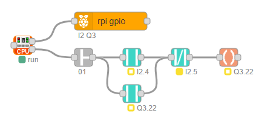

# node-red-contrib-redplc

Node-Red nodes for Software Programmable Logic Controller (PLC)

## Install
Install with Node-Red Palette Manager or npm command:

```
npm install node-red-contrib-redplc
```
## Usage

redPlc nodes implements Software PLC functionality in Node-Red.<br>
The control logic is realized as [ladder logic](https://en.wikipedia.org/wiki/Ladder_logic) (LD) according standard IEC 61131-3.<br>

redPlc nodes use the graphical environment of Node-Red for<br>
programming the control logic tasks. 

redPlc is written in pure Javascript and works on all<br>
platforms where Node-Red runs.<br>

Module nodes maps hardware or communication data to global variables.<br>
Module nodes must installed depends of used hardware or communication.<br>

Global variables use predefined unique names and format.<br>
Each variable are unique with subsequent address number.<br>
Address range is 0..999.<br>
For easy handling, redPlc has only datatypes UINT32, LREAL and WSTRING.<br>

Global variables:<br>

|Var|Function|Datatype|Array|
|:-|:-|:-|:-|
|I|Digital Input|UINT32||
|Q|Digital Output|UINT32||
|M|Digital Memory|UINT32||
|FF|Flip-Flop|UINT32||
|C|Counter|UINT32||
|T|Timer|UINT32||
|IA|Analog Input|LREAL|16|
|QA|Analog Output|LREAL|16|
|MA|Analog Memory|LREAL||
|IS|String Input|WSTRING|16|
|QS|String Output|WSTRING|16|
|MS|String Memory|WSTRING||

## Example

<br>
Ladder Logic with Raspberry Pi GPIO module.<br>
Contacts are used for latch coil.<br>

## Nodes

#### **- CPU Node -**
Is the main engine of redPlc.<br>
It performs a cyclical sequential operation.<br>
Module nodes are wired to first output.<br>
Ladder logic nodes are wired to second and next outputs.<br>

#### **- Sys-Start Node -**
Sends one message on start.<br>
It can be used for initializing.

#### **- Contact Node -**
Implements a ladder contact.<br>
If closed, input power (true or false) is send to output.<br>
If open, no power (false) is send to output.<br>
Wiring contact node in series works as AND logic.<br>
Wiring contact node parallel works as OR logic.<br>
Any logical wiring combination are possible.

#### **- Coil Node -**
Implements a ladder coil.<br>
Energized if input condition is true.<br>
Deenergized if input condition is false.<br>

#### **- Function Node -**
Implements digital functions.<br>
These are NOP, NOT, OR, AND and XOR.<br>
P_TRIGGER and N_TRIGGER for edge detection<br> 

#### **- Flip Flop Node -**
Sets output with dominant reset/set inputs.<br>

#### **- Counter Node -**
CTU counts up.<br>
CTD counts down.<br>
CTUD counts up/down.<br>

#### **- Timer Node -**
TON delays on.<br>
TOF delays off.<br>
TP produce an on/off pulse.<br>
TPI produce an on/off pulse interval.<br>
TONR is a retentive on timer.<br>

## Donate
If you like my work please support it with donate:

[](https://www.paypal.com/cgi-bin/webscr?cmd=_s-xclick&hosted_button_id=ZDRCZBQFWV3A6)
